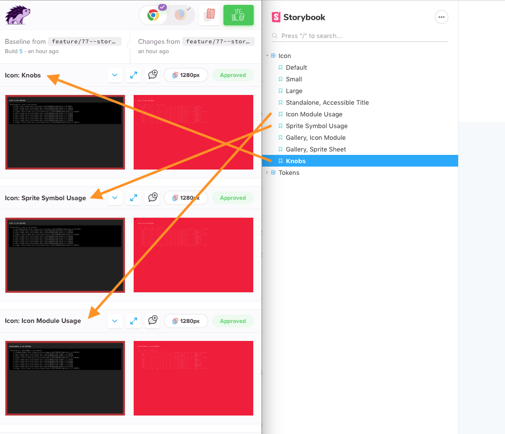

# ESDS Storybook

## Running the storybook environment
From this directory:

```bash
npm start
```

This will run the storybook environment _by itself_. Changes made to component, icon, or token source code will not be hot-reloaded. To work on a component's source in a hot-reloading environment see the [component dev environment documentation](../../components/README.md).

## VRT
`npm test`

Tests are executed using [Percy](https://percy.io). Notifications will be posted to the EightShapes design system slack channel when test runs complete.

## Writing Tests
A test file will be automatically created by the New Component Generator (TBD)

### Format
Tests use the [Storybook Docs](https://github.com/storybookjs/storybook/tree/master/addons/docs) MDX format:

```html
import { Meta, Story, Preview } from '@storybook/addon-docs/blocks';
import { html } from 'lit-html';

import '@eightshapes/esds-icon'; // Import the Web Component

<Meta
  title="Icon"
  component='esds-icon'
/>

# Icon
## Installation

<pre>
npm install @eightshapes/esds-icon
</pre>

## Default
<Preview>
  <Story name="Default">
    {html`<esds-icon></esds-icon>`}
  </Story>
</Preview>


## Small
<Preview>
  <Story name="Small">
    {html`<esds-icon size="small"></esds-icon>`}
  </Story>
</Preview>
```

### What to Test
Create tests to exercise each aspect of the component:
* Props & all values
* Slots (named & default)
* Methods - if there's a visible change as a result of a method, call the method so the visible change is shown
* Events - if there's a visible change that can be triggered by an event, call the event so the visible change is shown
* Content resilience
  * Add too much content. Trigger text wrapping and intentionally break the layout.
  * Provide too little content. Does the component have a valid empty state?

### What VRT sees
Each `<Story>` will be sent to [Percy](https://percy.io) as an individual screenshot.



## Debugging VRT
`npm run build-storybook`

This will create a compiled version of storybook at `./storybook-static`. This build artifact is used by VRT. If there are discrepancies between VRT results and what's shown when running the local environment, manually build this static asset and confirm it matches what VRT is displaying.

## Accessibility Testing
The [Storybook Accessibility Addon](https://github.com/storybookjs/storybook/tree/master/addons/a11y) is enabled for all stories in the project. If the accessibility pane is not visible, choose "Show Addons" from the Storybook menu.


The accessibility addon **will not** fix all accessibility issues. An additional, manual, accessibility review step is recommended.

---
## Dependencies
* [@babel/core](https://github.com/babel/babel/tree/master/packages/babel-core)  
Dependency of [Storybook Docs Addon](https://github.com/storybookjs/storybook/tree/master/addons/docs)

* [@storybook/addon-a11y](https://github.com/storybookjs/storybook/tree/master/addons/a11y)  
Adds automated accessibility testing to storybook stories

* [@storybook/addon-docs](https://github.com/storybookjs/storybook/tree/master/addons/docs)  
Allows stories to be written using a combination of markdown and JSX tags.

* [@storybook/addon-knobs](https://github.com/storybookjs/storybook/tree/master/addons/knobs)  
Allows dynamic editing of component props via the Storybook UI

* [@storybook/addon-viewport](https://github.com/storybookjs/storybook/tree/master/addons/viewport)  
Makes stories resizable and responsive based on common device viewports.

* [@storybook/web-components](https://github.com/storybookjs/storybook/tree/next/app/web-components)  
Allows lit-element based web components to execute in the Storybook environment

* [babel-loader](https://www.npmjs.com/package/babel-loader)  
Dependency of [Storybook Docs Addon](https://github.com/storybookjs/storybook/tree/master/addons/docs)

* [lit-html](https://lit-html.polymer-project.org)  
Used to author web-component Storybook stories.

* [react](https://www.npmjs.com/package/react)  
Dependency of [Storybook Docs Addon](https://github.com/storybookjs/storybook/tree/master/addons/docs)

* [react-is](https://www.npmjs.com/package/react-is)  
Dependency of [Storybook Docs Addon](https://github.com/storybookjs/storybook/tree/master/addons/docs)
